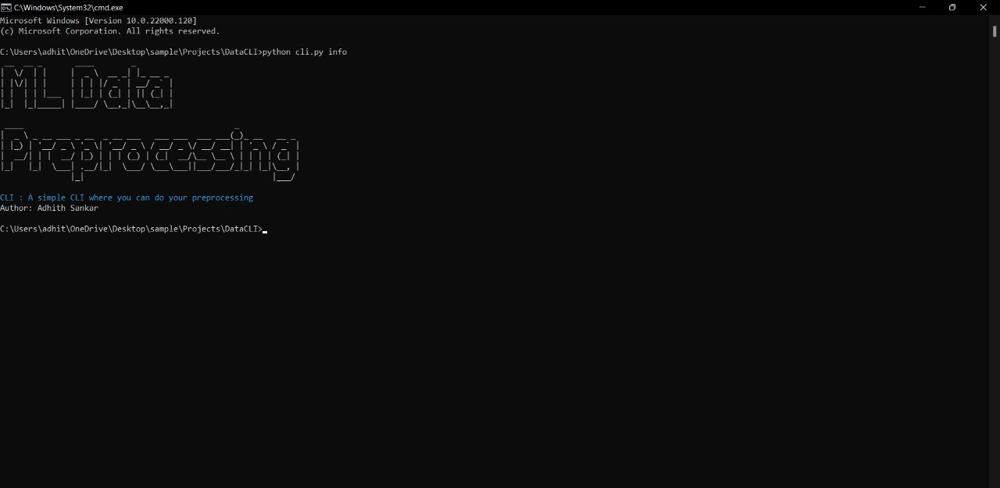
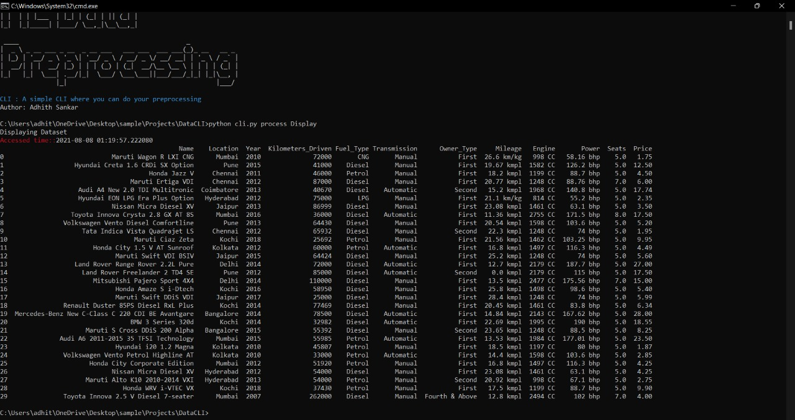

DataCLI
=======

``DataCLI`` : A simple CLI where you can perform your ML data preprocessing with ease

Guide : 

1. Open Terminal from the (cli.py) file location
2. Make sure you have all the dependencies installed
3. Rename your excel file to "Data.xlsx"
4. Use the Command Guide to use the different CLI commands

Dependencies : 

``DataCLI`` was designed with CLICK with the following dependencies:
 - numpy
 - pandas
 - pyfiglet

Screenshots :

 

